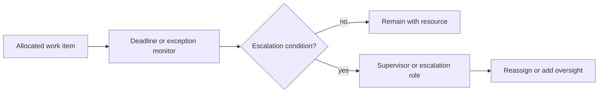

---
title: "Escalation"
category: "[[Resources/_Resource Patterns|Resource Patterns]]"
---
Intent: Move a work item to a higher authority or broader responsibility channel when normal handling fails or time expires.

Use when: Deadlines, exception severity, authorization limits, or unresolved states require management attention or specialist intervention.

Modeling notes: Define escalation triggers separately from escalation targets. Escalation may add visibility, reallocate the item, increase priority, or create a new supervisory work item.

Source: [workflowpatterns.com](http://workflowpatterns.com/patterns/resource/detour/wrp28.php).
