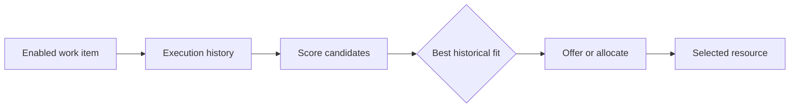

---
title: "History-Based Distribution"
category: "[[Resources/_Resource Patterns|Resource Patterns]]"
---
Intent: Use previous work execution data to influence who receives the next work item.

Use when: The best assignment depends on past participation, throughput, error rate, familiarity, fairness, or prior decisions in the same case type.

Modeling notes: Specify which history matters and how far back it reaches. Avoid hidden feedback loops: if history is used for workload balancing or quality routing, make the scoring criteria auditable.

Source: [workflowpatterns.com](http://workflowpatterns.com/patterns/resource/creation/wrp9.php).
