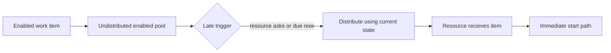

---
title: "Late Distribution"
category: "[[Resources/_Resource Patterns|Resource Patterns]]"
---
Intent: Postpone distribution until the work item is about to start or until a resource requests work.

Use when: Fresh resource information is more important than early notification, or when work should remain pooled until actual execution demand exists.

Modeling notes: Keep the item enabled and available but not assigned. Specify what event triggers late distribution, such as a start request, batch dispatch, due date, or capacity signal.

Source: [workflowpatterns.com](http://workflowpatterns.com/patterns/resource/push/wrp20.php).
