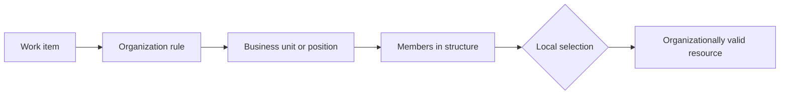

---
title: "Organisational Distribution"
category: "[[Resources/_Resource Patterns|Resource Patterns]]"
---
Intent: Route work according to organizational structure such as unit, position, location, reporting line, or department.

Use when: The process must respect business ownership boundaries, geographic branches, cost centers, or escalation paths defined by the organization.

Modeling notes: Model the organizational hierarchy separately from workflow logic and reference it through rules. Account for matrix organizations where a resource may belong to several units at once.

Source: [workflowpatterns.com](http://workflowpatterns.com/patterns/resource/creation/wrp10.php).
