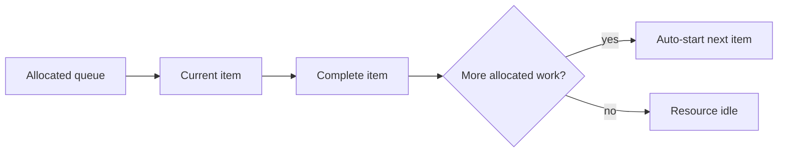

---
title: "Piled Execution"
category: "[[Resources/_Resource Patterns|Resource Patterns]]"
---
Intent: Automatically start the next allocated work item for a resource when they complete the current one.

Use when: A resource should process a queue continuously, such as production work, call handling, robotic task execution, or batch-like back office activity.

Modeling notes: Model the queue ordering rule and the trigger from completion to next start. Include stop conditions so the resource can pause, go unavailable, or handle priority interrupts.

Source: [workflowpatterns.com](http://workflowpatterns.com/patterns/resource/autostart/wrp38.php).
