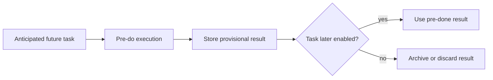

---
title: "Pre-Do"
category: "[[Resources/_Resource Patterns|Resource Patterns]]"
---
Intent: Allow work to be performed before the normal control-flow point at which it would become enabled.

Use when: A resource can prepare or complete work early based on anticipated need, reducing delay when the formal step is reached.

Modeling notes: Distinguish pre-do from early distribution: pre-do is execution before formal enablement, not merely notification. Define what happens if the process path later proves the work unnecessary.

Source: [workflowpatterns.com](http://workflowpatterns.com/patterns/resource/detour/wrp35.php).
