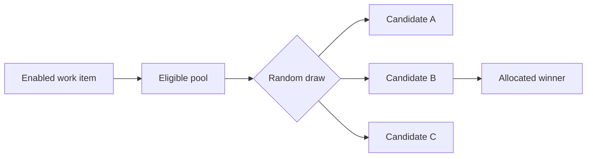

---
title: "Random Allocation"
category: "[[Resources/_Resource Patterns|Resource Patterns]]"
---
Intent: Allocate a work item to one eligible resource by random choice.

Use when: All candidates are equivalent for the work and a simple unbiased distribution is acceptable.

Modeling notes: Restrict randomness to the eligible pool after applying authorization, availability, and capability filters. Record the chosen resource so later audits can distinguish random selection from manual assignment.

Source: [workflowpatterns.com](http://workflowpatterns.com/patterns/resource/push/wrp15.php).
