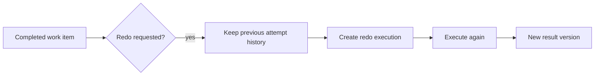

---
title: "Redo"
category: "[[Resources/_Resource Patterns|Resource Patterns]]"
---
Intent: Allow completed work to be performed again, replacing or supplementing the previous result.

Use when: Review finds an error, data changes, quality control rejects output, or a later event invalidates earlier work.

Modeling notes: Model redo as a controlled return from completed state to executable state. Preserve prior attempts for audit and define whether the same resource, a different resource, or a reviewer must perform the redo.

Source: [workflowpatterns.com](http://workflowpatterns.com/patterns/resource/detour/wrp34.php).
