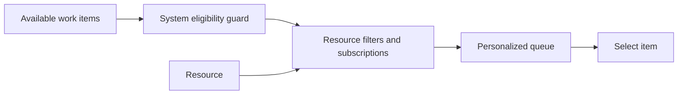

---
title: "Resource-Determined Work Queue Content"
category: "[[Resources/_Resource Patterns|Resource Patterns]]"
---
Intent: Allow the resource to influence or configure which work items appear in their queue.

Use when: Skilled workers need to filter, sort, subscribe to, or choose work categories based on their own context and capacity.

Modeling notes: Keep resource preferences inside policy boundaries. The system should still enforce authorization and priority constraints even when the resource controls the queue view.

Source: [workflowpatterns.com](http://workflowpatterns.com/patterns/resource/pull/wrp25.php).
