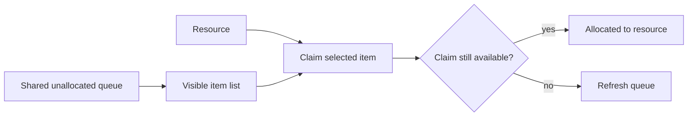

---
title: "Resource-Initiated Allocation"
category: "[[Resources/_Resource Patterns|Resource Patterns]]"
---
Intent: Allow a resource to select an unallocated work item and allocate it to themselves.

Use when: Workers pull from a shared pool based on readiness, expertise, priority, or personal capacity instead of receiving assignments from the system.

Modeling notes: Model the transition from visible unallocated item to allocated item as an atomic claim. Include race handling so two resources cannot successfully claim the same work item.

Source: [workflowpatterns.com](http://workflowpatterns.com/patterns/resource/pull/wrp21.php).
