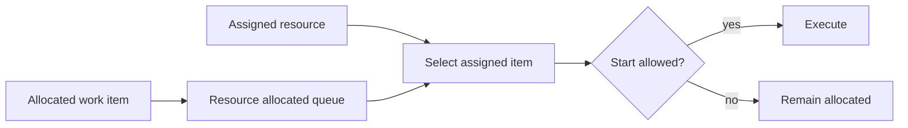

---
title: "Resource-Initiated Execution - Allocated Work Item"
category: "[[Resources/_Resource Patterns|Resource Patterns]]"
---
Intent: Let the allocated resource decide when to start a work item that is already assigned to them.

Use when: The resource controls sequencing within their allocated queue and may choose among assigned tasks.

Modeling notes: Allocation and execution are distinct states. Capture start as a resource action, and enforce authorization, prerequisites, and locking at that point rather than assuming allocation means work has begun.

Source: [workflowpatterns.com](http://workflowpatterns.com/patterns/resource/pull/wrp22.php).
