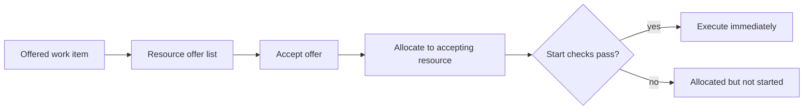

---
title: "Resource-Initiated Execution - Offered Work Item"
category: "[[Resources/_Resource Patterns|Resource Patterns]]"
---
Intent: Let a resource accept an offered work item and begin execution as part of the same pull action.

Use when: Offers are visible invitations and accepting one should immediately make the accepting resource responsible and active.

Modeling notes: Model acceptance, allocation, and start as separate logical effects even if the user action is one click. This makes declines, timeouts, and failed start checks easier to reason about.

Source: [workflowpatterns.com](http://workflowpatterns.com/patterns/resource/pull/wrp23.php).
