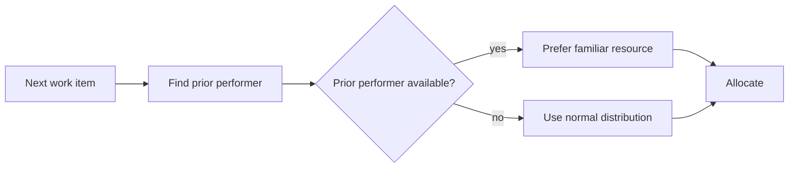

---
title: "Retain Familiar"
category: "[[Resources/_Resource Patterns|Resource Patterns]]"
---
Intent: Prefer a resource that has previously worked on the case or a related item.

Use when: Prior context improves speed, quality, or customer experience, but complete case ownership is too strong or not always possible.

Modeling notes: Record resource participation history and use it as a preference rather than an absolute rule unless policy requires continuity. Define fallback behavior when the familiar resource is unavailable or no longer eligible.

Source: [workflowpatterns.com](http://workflowpatterns.com/patterns/resource/creation/wrp7.php).
