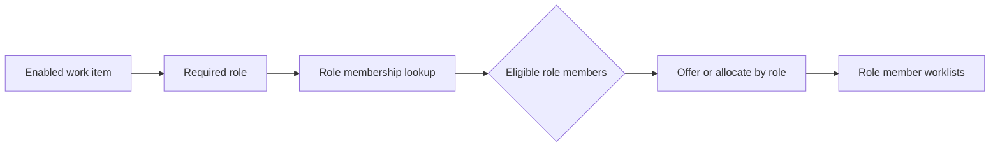

---
title: "Role-Based Distribution"
category: "[[Resources/_Resource Patterns|Resource Patterns]]"
---
Intent: Route work to resources that occupy a required role rather than to a named individual.

Use when: The process depends on a business responsibility such as clerk, manager, reviewer, or nurse, and any current member of that role can legitimately perform the task.

Modeling notes: Represent the role as part of the organization model, not as duplicated task logic. Decide whether the role produces offers to all matching resources or an allocation to one selected member.

Source: [workflowpatterns.com](http://workflowpatterns.com/patterns/resource/creation/wrp2.php).
