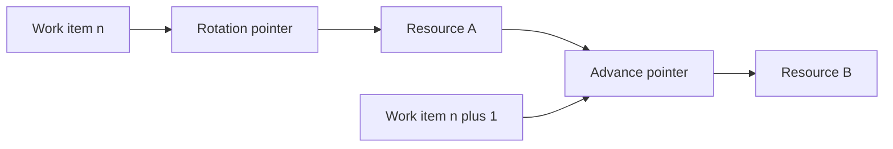

---
title: "Round Robin Allocation"
category: "[[Resources/_Resource Patterns|Resource Patterns]]"
---
Intent: Allocate successive work items across eligible resources in a rotating order.

Use when: Fairness and predictable workload distribution matter more than optimizing each individual assignment.

Modeling notes: Store the rotation pointer and define how skipped, unavailable, or newly added resources affect the cycle. Apply eligibility filtering before advancing the pointer if only some resources can perform the item.

Source: [workflowpatterns.com](http://workflowpatterns.com/patterns/resource/push/wrp16.php).
