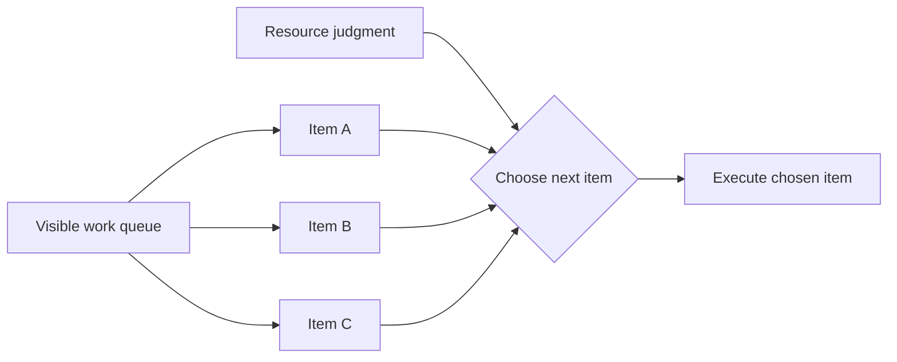

---
title: "Selection Autonomy"
category: "[[Resources/_Resource Patterns|Resource Patterns]]"
---
Intent: Give a resource discretion to choose which visible work item to perform next.

Use when: Work quality or efficiency depends on human judgment about priority, context, batching, specialization, or readiness.

Modeling notes: Separate autonomy over selection from autonomy over eligibility. The system may determine the visible set while the resource chooses the execution order inside that set.

Source: [workflowpatterns.com](http://workflowpatterns.com/patterns/resource/pull/wrp26.php).
