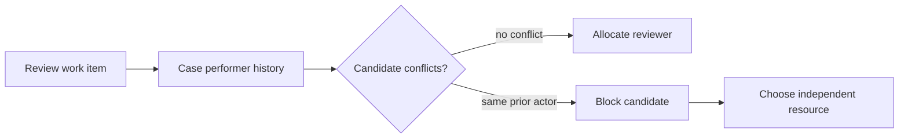

---
title: "Separation of Duties"
category: "[[Resources/_Resource Patterns|Resource Patterns]]"
---
Intent: Prevent the same resource, or conflicting resources, from performing combinations of related tasks.

Use when: Fraud prevention, review independence, audit policy, or maker-checker rules require different actors across a case or a set of activities.

Modeling notes: Store task history and compare the candidate resource against prior performers. Model both strict separation from the same individual and broader conflicts such as same team, same reporting line, or same role.

Source: [workflowpatterns.com](http://workflowpatterns.com/patterns/resource/creation/wrp5.php).
