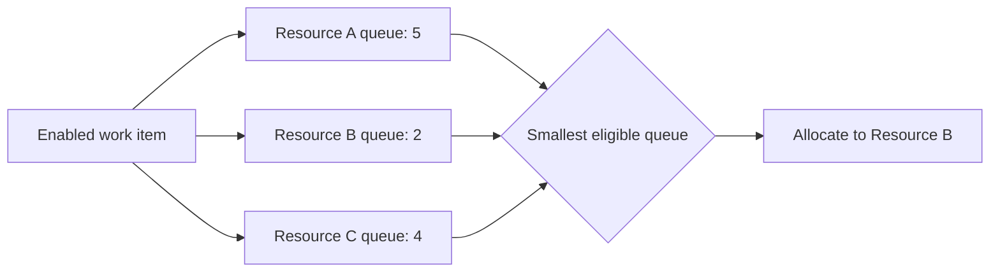

---
title: "Shortest Queue"
category: "[[Resources/_Resource Patterns|Resource Patterns]]"
---
Intent: Allocate work to the eligible resource with the smallest current queue.

Use when: The process aims to balance backlog and reduce waiting time across similarly capable resources.

Modeling notes: Define which queue counts: offered, allocated, started, suspended, or all outstanding work. Consider weighting items by estimated effort because a count-only queue can misrepresent workload.

Source: [workflowpatterns.com](http://workflowpatterns.com/patterns/resource/push/wrp17.php).
