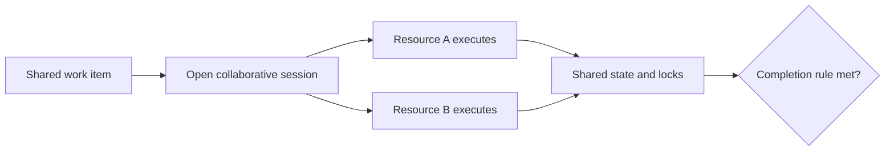

---
title: "Simultaneous Execution"
category: "[[Resources/_Resource Patterns|Resource Patterns]]"
---
Intent: Allow multiple resources to execute the same work item at the same time.

Use when: Collaboration, paired review, joint decision making, training, or parallel specialist input is required on one work item rather than on separate cloned tasks.

Modeling notes: Model shared state, locking, and completion semantics carefully. Decide whether all resources must finish, one resource can complete for all, or the work item remains open until a coordination rule is satisfied.

Source: [workflowpatterns.com](http://workflowpatterns.com/patterns/resource/multiple_resources/wrp42.php).
