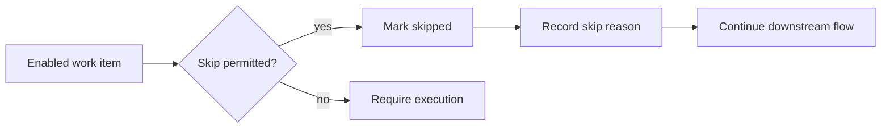

---
title: "Skip"
category: "[[Resources/_Resource Patterns|Resource Patterns]]"
---
Intent: Allow a resource or rule to bypass a work item without executing it.

Use when: The task is optional, no longer relevant, conditionally unnecessary, or explicitly waived under controlled circumstances.

Modeling notes: Treat skip as a completion path with its own reason, authorization, and audit trail. Do not confuse skip with cancellation of the whole case; downstream control-flow may still continue.

Source: [workflowpatterns.com](http://workflowpatterns.com/patterns/resource/detour/wrp33.php).
