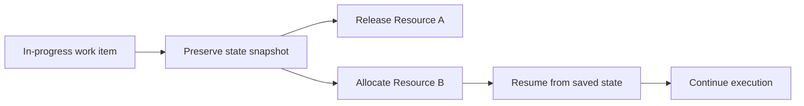

---
title: "Stateful Reallocation"
category: "[[Resources/_Resource Patterns|Resource Patterns]]"
---
Intent: Reassign a started or partially completed work item while preserving its execution state.

Use when: Work must continue after handover without losing entered data, intermediate decisions, timers, or progress markers.

Modeling notes: Model the state snapshot that moves with the work item and the handover obligations for the receiving resource. Include concurrency protection if the original resource may still have the item open.

Source: [workflowpatterns.com](http://workflowpatterns.com/patterns/resource/detour/wrp30.php).
