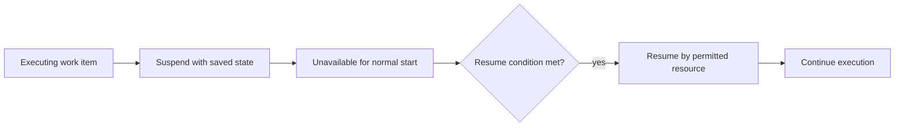

---
title: "Suspension-Resumption"
category: "[[Resources/_Resource Patterns|Resource Patterns]]"
---
Intent: Allow a resource to pause a started work item and later continue it from the suspended state.

Use when: Work depends on external information, a temporary interruption, or resource scheduling, and partial progress should not be lost.

Modeling notes: Model suspended as a distinct lifecycle state with ownership, visibility, timers, and resumption permissions. Decide whether suspended work counts against queue load and due dates.

Source: [workflowpatterns.com](http://workflowpatterns.com/patterns/resource/detour/wrp32.php).
